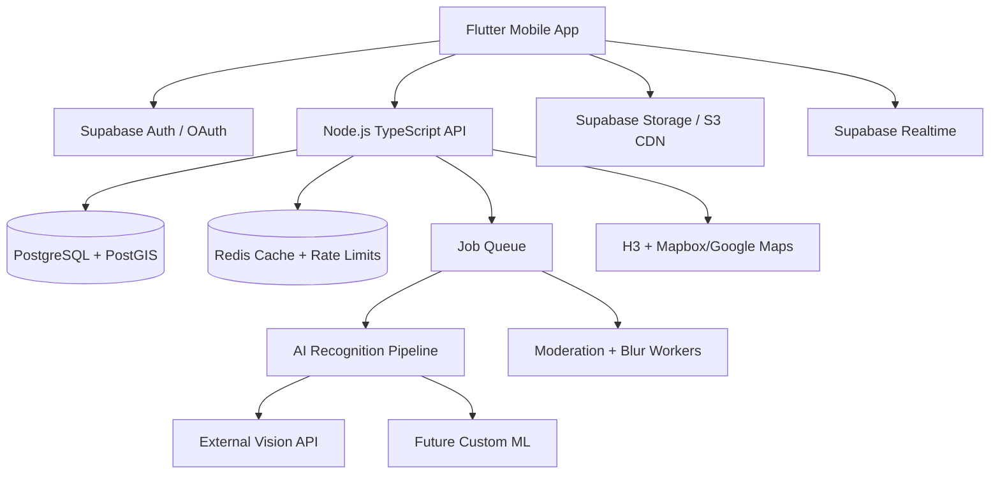
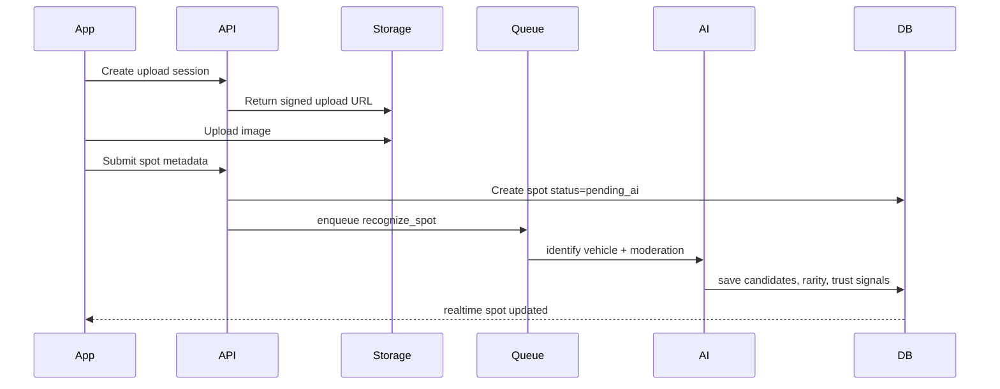

# Racers Vault Production Architecture

Racers Vault is a gamified AI vehicle-spotting platform: users capture real-world vehicles, AI identifies them, the rarity engine scores the sighting, and the user grows a digital garage while competing locally and globally.

The architecture should optimize for startup velocity first, while keeping clean paths toward scale, stronger anti-cheat, and custom ML later.

## 1. System Architecture



### Frontend

- Flutter app with feature-first modules.
- Offline-first local cache for feed, garage, pending uploads, profile, and challenges.
- Background upload queue for spot submissions.
- Dark mode by default with premium neon/metal visual language.
- Camera-first flow for higher trust and full points.
- Gallery uploads allowed but marked lower trust.

### Backend

- Supabase/PostgreSQL for core data, auth, storage, realtime.
- Node.js/TypeScript API for business logic that should not live in the client:
  - rarity scoring
  - anti-cheat
  - duplicate checks
  - AI orchestration
  - leaderboard materialization
  - moderation decisions
- Redis for rate limiting, cached leaderboards, hot feeds, challenge progress.
- Queue workers for slow tasks: AI recognition, image moderation, blur processing, thumbnails.

### AI Pipeline



## 2. Database Schema

Use PostgreSQL with PostGIS and optional H3 index columns.

```sql
create table profiles (
  id uuid primary key references auth.users(id) on delete cascade,
  username text unique not null,
  display_name text,
  avatar_url text,
  country text,
  city text,
  xp int not null default 0,
  level int not null default 1,
  total_points int not null default 0,
  streak_days int not null default 0,
  created_at timestamptz not null default now(),
  updated_at timestamptz not null default now()
);

create table vehicles (
  id uuid primary key default gen_random_uuid(),
  make text not null,
  model text not null,
  generation text,
  year_start int,
  year_end int,
  body_type text,
  origin_country text,
  category text not null,
  production_volume int,
  created_at timestamptz not null default now()
);

create table spots (
  id uuid primary key default gen_random_uuid(),
  user_id uuid not null references profiles(id) on delete cascade,
  vehicle_id uuid references vehicles(id),
  status text not null default 'pending_ai',
  image_url text not null,
  thumb_url text,
  caption text default '',
  make text,
  model text,
  generation text,
  year_range text,
  category text not null default 'Cars',
  rarity_tier text not null default 'Common',
  points int not null default 0,
  ai_confidence numeric(4,3),
  corrected_by_user boolean not null default false,
  latitude numeric(10,7),
  longitude numeric(10,7),
  snapped_latitude numeric(10,7),
  snapped_longitude numeric(10,7),
  h3_index text,
  city text,
  country text,
  image_hash text,
  perceptual_hash text,
  capture_source text not null default 'unknown',
  trust_score int not null default 50,
  verification_status text not null default 'unverified',
  created_at timestamptz not null default now()
);

create unique index spots_image_hash_unique on spots(image_hash) where image_hash is not null;
create index spots_h3_idx on spots(h3_index);
create index spots_user_created_idx on spots(user_id, created_at desc);

create table garage_items (
  id uuid primary key default gen_random_uuid(),
  user_id uuid not null references profiles(id) on delete cascade,
  spot_id uuid not null references spots(id) on delete cascade,
  vehicle_id uuid references vehicles(id),
  rarity_tier text not null,
  points int not null,
  collected_at timestamptz not null default now(),
  unique(user_id, spot_id)
);

create table rarity_scores (
  id uuid primary key default gen_random_uuid(),
  vehicle_id uuid references vehicles(id),
  country text not null,
  city text,
  production_score numeric not null,
  regional_scarcity_score numeric not null,
  confidence_modifier numeric not null,
  event_multiplier numeric not null default 1,
  final_points int not null,
  tier text not null,
  config_version int not null,
  created_at timestamptz not null default now()
);

create table follows (
  follower_id uuid references profiles(id) on delete cascade,
  following_id uuid references profiles(id) on delete cascade,
  created_at timestamptz not null default now(),
  primary key (follower_id, following_id)
);

create table likes (
  user_id uuid references profiles(id) on delete cascade,
  spot_id uuid references spots(id) on delete cascade,
  created_at timestamptz not null default now(),
  primary key (user_id, spot_id)
);

create table comments (
  id uuid primary key default gen_random_uuid(),
  user_id uuid references profiles(id) on delete cascade,
  spot_id uuid references spots(id) on delete cascade,
  body text not null,
  created_at timestamptz not null default now()
);

create table reports (
  id uuid primary key default gen_random_uuid(),
  reporter_id uuid references profiles(id),
  spot_id uuid references spots(id),
  reason text not null,
  status text not null default 'open',
  created_at timestamptz not null default now()
);

create table achievements (
  id uuid primary key default gen_random_uuid(),
  code text unique not null,
  name text not null,
  description text not null,
  xp_reward int not null default 0
);

create table user_achievements (
  user_id uuid references profiles(id) on delete cascade,
  achievement_id uuid references achievements(id) on delete cascade,
  unlocked_at timestamptz not null default now(),
  primary key (user_id, achievement_id)
);

create table challenges (
  id uuid primary key default gen_random_uuid(),
  title text not null,
  description text not null,
  scope text not null,
  starts_at timestamptz not null,
  ends_at timestamptz not null,
  multiplier numeric not null default 1
);

create table leaderboards (
  id uuid primary key default gen_random_uuid(),
  scope text not null,
  scope_key text not null,
  period text not null,
  user_id uuid references profiles(id),
  points int not null,
  rank int not null,
  computed_at timestamptz not null default now()
);
```

## 3. Rarity Engine

Rarity must be configurable and versioned.

```ts
finalPoints =
  baseTierPoints
  * productionModifier
  * regionalScarcityModifier
  * confidenceModifier
  * trustModifier
  * eventMultiplier
```

Suggested tiers:

- Common: 10-25
- Uncommon: 25-75
- Rare: 75-150
- Epic: 150-300
- Legendary: 300+

Tradeoff: keep the first version simple and explainable. Do not overfit production volume data before there is enough user activity.

## 4. API Design

Base: `/v1`

### Auth

Use Supabase Auth for JWT/OAuth.

- `POST /auth/oauth/google`
- `POST /auth/oauth/apple`
- `GET /me`

### Upload Flow

`POST /spots/upload-session`

```json
{
  "contentType": "image/jpeg",
  "captureSource": "camera"
}
```

```json
{
  "uploadUrl": "https://...",
  "storagePath": "spots/user/uuid.jpg",
  "expiresIn": 300
}
```

`POST /spots`

```json
{
  "storagePath": "spots/user/uuid.jpg",
  "caption": "Seen near the cafe",
  "latitude": 19.076,
  "longitude": 72.8777,
  "captureSource": "camera",
  "imageHash": "sha256...",
  "perceptualHash": "abcd..."
}
```

```json
{
  "spotId": "uuid",
  "status": "pending_ai"
}
```

### Spot Read APIs

- `GET /spots/feed?category=Italian&city=Mumbai`
- `GET /spots/:id`
- `POST /spots/:id/like`
- `DELETE /spots/:id/like`
- `POST /spots/:id/comments`
- `POST /spots/:id/report`
- `PATCH /spots/:id/correction`

Correction example:

```json
{
  "make": "Porsche",
  "model": "911 GT3 RS",
  "generation": "992",
  "yearRange": "2022-2026"
}
```

### Garage

- `GET /garage`
- `GET /garage/stats`
- `GET /garage/search?q=Ferrari&rarity=Legendary`

### Map

- `GET /map/spots?bbox=minLng,minLat,maxLng,maxLat&category=Supercars`
- `GET /map/heatmap?h3Resolution=8`

### Leaderboards

- `GET /leaderboards/local?city=Mumbai&period=weekly`
- `GET /leaderboards/global?period=season`

## 5. Folder Structure

```text
apps/
  mobile_flutter/
    lib/
      app/
      core/
        auth/
        routing/
        theme/
        offline/
      features/
        camera/
        spotting/
        garage/
        feed/
        map/
        leaderboard/
        profile/
        challenges/
      shared/
        widgets/
        models/
        services/

services/
  api/
    src/
      modules/
        auth/
        spots/
        garage/
        rarity/
        leaderboards/
        moderation/
        maps/
      infra/
        db/
        redis/
        queue/
        storage/
      main.ts
  workers/
    src/
      recognizeSpot.worker.ts
      moderateImage.worker.ts
      leaderboard.worker.ts

packages/
  shared-types/
  rarity-engine/
  ai-adapters/
  h3-geo/
```

## 6. Security + Anti-Cheat

MVP:

- JWT auth on all write endpoints.
- RLS on user-owned records.
- Exact image hash duplicate blocking.
- Perceptual hash near-duplicate flagging.
- Camera uploads receive higher trust score.
- Gallery uploads receive reduced trust until reviewed.
- Location snapping to coarse cells before public display.
- Rate limits per user/IP/device.
- Report flow for fake/stolen posts.

Next:

- Face/license plate blur worker.
- Screenshot/watermark detection.
- EXIF timestamp/location comparison.
- Fake GPS heuristics:
  - impossible travel speed
  - mismatched IP region
  - emulator/root/debug signals
  - repeated jumps between distant H3 cells
- AI-generated image detection.
- Two-angle proof mode for high-value spots.

## 7. AI Pipeline

Start with external APIs behind an abstraction:

```ts
interface VehicleRecognitionProvider {
  recognize(input: RecognitionInput): Promise<RecognitionResult>;
}
```

Pipeline:

1. Validate upload.
2. Create hashes.
3. Blur faces/plates on public version.
4. Run vehicle recognition.
5. Return candidates:
   - make
   - model
   - generation
   - year range
   - body type
   - category
   - confidence
6. If confidence is low, mark `needs_user_confirmation`.
7. Store user correction.
8. Later export corrections into training dataset.

## 8. Scalability Plan

First 10k users:

- Supabase Postgres + Storage.
- Node API on one autoscaled service.
- Redis for rate limits and leaderboards.
- Background workers for AI.

100k-1M users:

- CDN image delivery.
- Async thumbnails and blur variants.
- Partition spots by time/region if needed.
- Materialized leaderboard tables.
- Cache hot feeds and map tiles.
- Queue AI work with retry/dead-letter queues.

Millions:

- Dedicated Postgres read replicas.
- Regional API deployment.
- Separate analytics warehouse.
- Vector/search service for vehicle database and garage search.
- Custom ML inference service for cost control.

## 9. UI/UX Guidelines

Design language:

- dark, premium, fast, metallic, neon accent
- dense but readable
- motion for rewards, not for decoration
- map and camera are primary surfaces
- cards should feel collectible

Core loop:

```text
Open app -> see nearby challenge -> capture vehicle -> AI reveals identity -> points animation -> added to garage -> rank movement
```

Important UX rules:

- Do not require car knowledge.
- AI should explain the find in plain language.
- Manual correction should be easy but secondary.
- Ranking and collection progress should be visible immediately.
- Show trust/verification without shaming honest gallery users.

## 10. MVP Roadmap

### Phase 1: Addictive Core

- Auth
- Camera/gallery spotting
- AI recognition
- rarity points
- garage
- feed
- categories
- duplicate protection
- basic leaderboard
- Supabase storage/database

### Phase 2: Social + Map

- followers
- likes/comments
- reports
- map spots
- H3 heatmaps
- weekly challenges
- achievements
- plate/face blur worker

### Phase 3: Scale + Moat

- custom rarity database
- correction training loop
- custom ML model
- verified proof shots
- seasonal events
- brand partnerships
- advanced moderation

## 11. Monetization

Avoid intrusive ads.

- Premium profile cosmetics.
- Garage themes and card skins.
- Pro analytics for power users.
- Event passes.
- Brand-sponsored challenges.
- Dealership/event discovery partnerships.
- Optional premium map filters.

Do not sell precise user location. Keep trust high.

## 12. Deployment Strategy

MVP:

- Flutter Android first.
- Supabase hosted Postgres/Auth/Storage.
- Node recognizer/API on Render/Fly.io/Railway/Cloud Run.
- Redis via Upstash.
- GitHub Actions:
  - lint/test
  - build Android
  - deploy API

Production:

- Cloud Run or Kubernetes for API/workers.
- S3/R2/Supabase Storage behind CDN.
- Managed Postgres with PITR backups.
- Sentry/Crashlytics for app errors.
- OpenTelemetry for backend traces.
- Feature flags for AI provider switching.

## Key Tradeoffs

- Supabase is fastest for MVP, but keep business logic in a Node API so migration is possible.
- External AI is faster now, custom ML is cheaper later at scale.
- Camera-first trust is practical; full fraud prevention is a long-term system.
- H3 should be added early to avoid painful map migrations later.
- Rarity scoring should start simple and versioned, then become data-driven.
